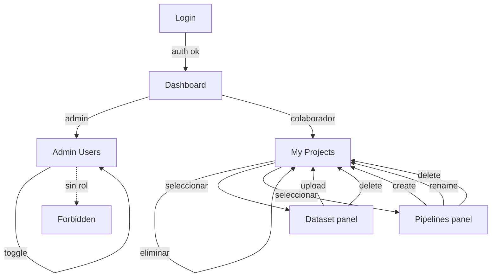
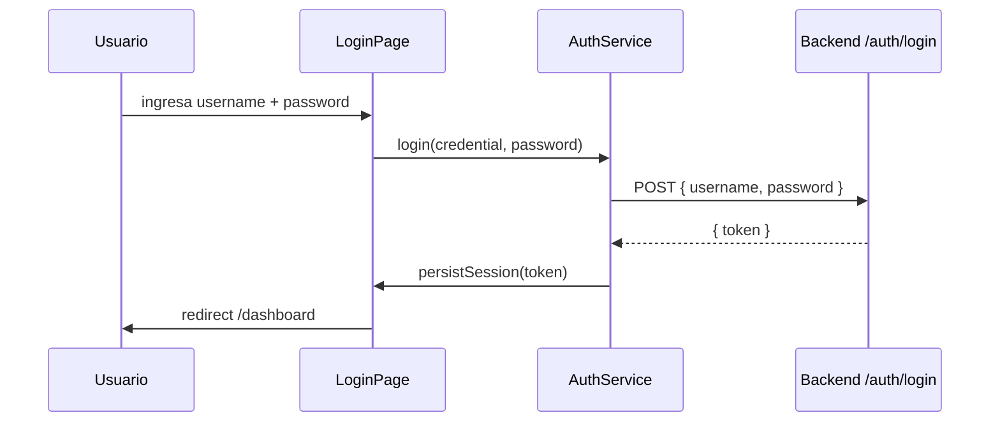
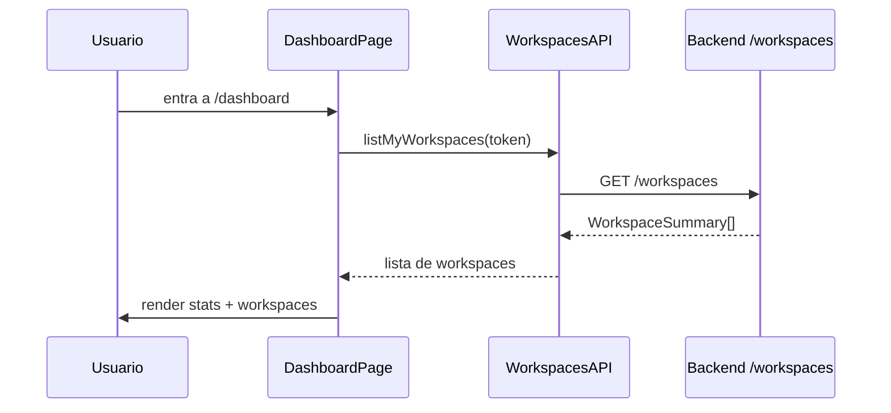
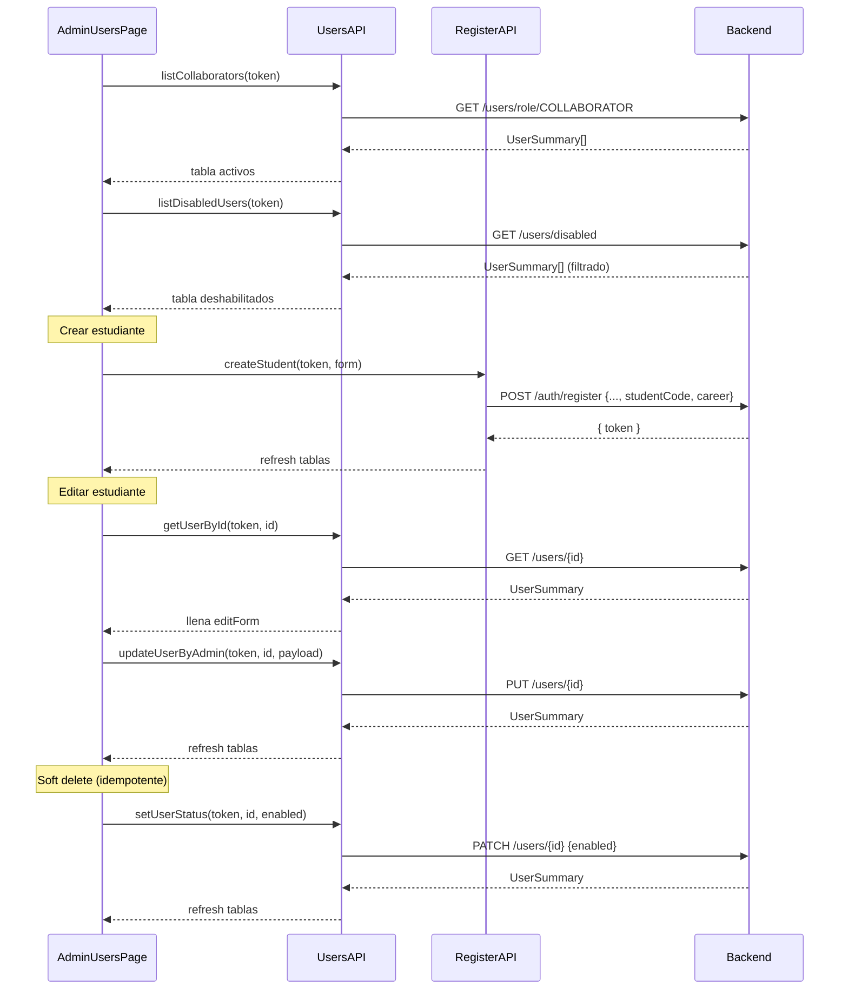
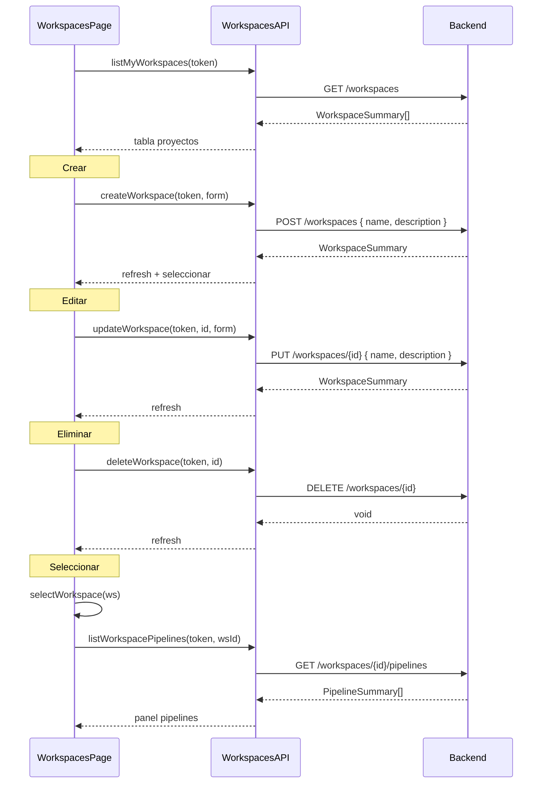
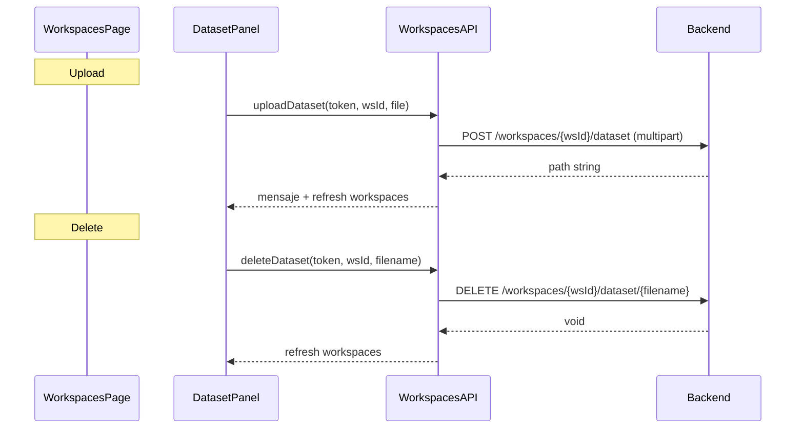
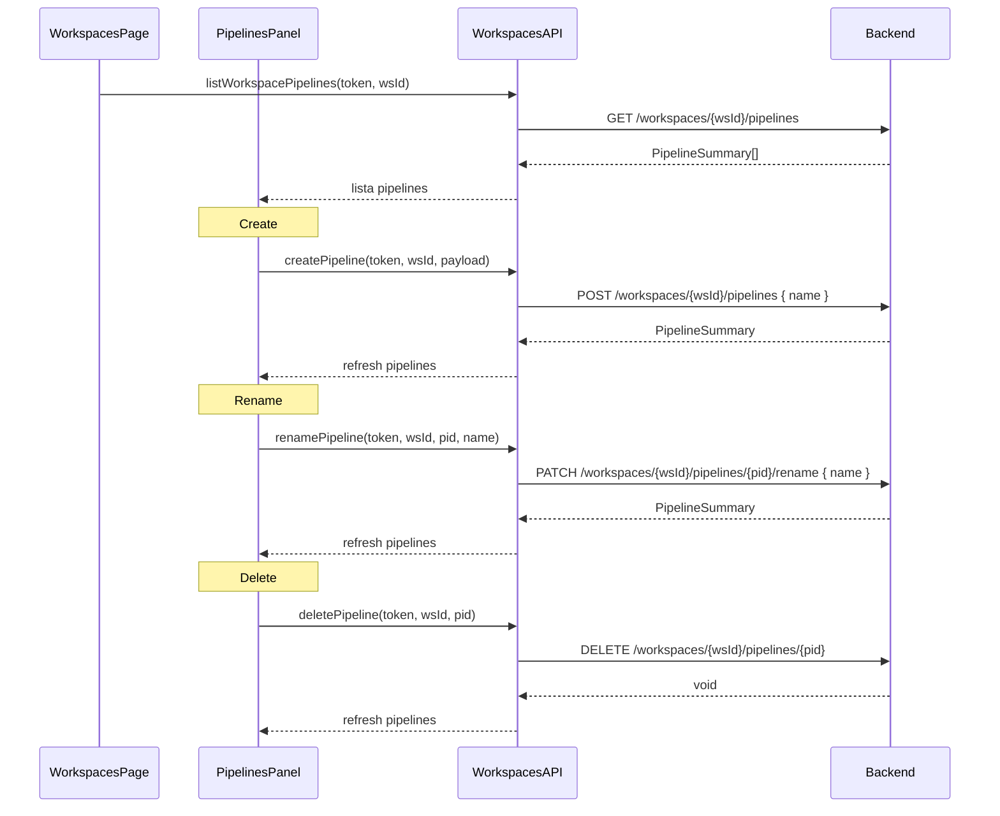
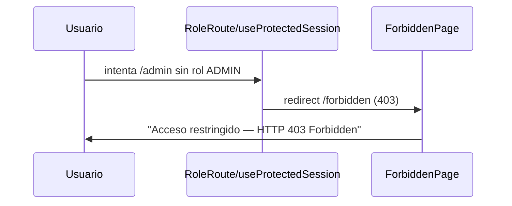

# SynapseOps — Mockup funcional

---

## 1. Login

**Componentes implementados:**
| Archivo | Rol |
|---|---|
| `modules/auth/pages/LoginPage.tsx` | Orquestación del login |
| `features/auth/components/LoginForm.tsx` | UI del formulario |
| `features/auth/api.ts` | `login()`, `logout()` |
| `features/auth/auth.mapper.ts` | `parseJwtClaims`, `mapTokenToSessionUser` |
| `features/auth/hooks/useAuthSession.ts` | `persistSession`, `clearAuth` |

---

## 2. Dashboard

**Componentes implementados:**
| Archivo | Rol |
|---|---|
| `modules/dashboard/pages/DashboardPage.tsx` | Vista de resumen |
| `features/workspaces/api.ts` | `listMyWorkspaces` |
| `shared/layout/AppShell.tsx` | Sidebar, header, logout |
| `features/auth/hooks/useProtectedSession.ts` | Sesión, 401/403, logout |

---

## 3. Admin Users

**Componentes implementados:**
| Archivo | Rol |
|---|---|
| `modules/users/pages/AdminUsersPage.tsx` | Orquestación |
| `features/admin-users/api.ts` | Todos los endpoints de users |
| `features/admin-users/components/CreateStudentForm.tsx` | Form alta con studentCode + career |
| `features/admin-users/components/EditStudentForm.tsx` | Form edición |
| `features/admin-users/components/UsersTable.tsx` | Tabla activos/deshabilitados |
| `features/admin-users/types.ts` | Tipos con studentCode, career, mapeo carrer |

---

## 4. My Projects

**Componentes implementados:**
| Archivo | Rol |
|---|---|
| `modules/workspaces/pages/WorkspacesPage.tsx` | Orquestación completa |
| `features/workspaces/api.ts` | list, create, update, delete |
| `features/workspaces/components/WorkspaceForm.tsx` | Form crear/editar |
| `features/workspaces/components/WorkspacesTable.tsx` | Tabla de proyectos |
| `features/workspaces/components/DatasetPanel.tsx` | Upload/delete dataset |
| `features/workspaces/components/PipelinesPanel.tsx` | CRUD pipelines |
| `features/workspaces/types.ts` | Tipos del módulo |

---

## 5. Dataset

---

## 6. Pipelines

---

## 7. Forbidden

**Componentes implementados:**
| Archivo | Rol |
|---|---|
| `routes/ProtectedRoute.tsx` | Bloquea si no está autenticado |
| `routes/RoleRoute.tsx` | Bloquea si no tiene el rol requerido |
| `pages/ForbiddenPage.tsx` | Pantalla 403 |

---

## Estructura del frontend

```mermaid
graph TD
    APP[App.tsx]
    ROUTER[app/router/AppRouter.tsx]
    SHELL[shared/layout/AppShell.tsx]
    STORE[store/useAppStore.ts]
    PROT[routes/ProtectedRoute.tsx]
    ROLE[routes/RoleRoute.tsx]

    APP --> ROUTER
    ROUTER --> PROT
    ROUTER --> ROLE
    ROUTER --> LOGIN_P[modules/auth/pages/LoginPage.tsx]
    ROUTER --> DASH_P[modules/dashboard/pages/DashboardPage.tsx]
    ROUTER --> ADMIN_P[modules/users/pages/AdminUsersPage.tsx]
    ROUTER --> WS_P[modules/workspaces/pages/WorkspacesPage.tsx]
    ROUTER --> FORBIDDEN[pages/ForbiddenPage.tsx]

    PROT --> SHELL
    ROLE --> SHELL
    SHELL --> STORE

    subgraph Auth
        LOGIN_P --> AUTH_API[features/auth/api.ts]
        LOGIN_P --> AUTH_FORM[features/auth/components/LoginForm.tsx]
        LOGIN_P --> AUTH_HOOK[features/auth/hooks/useAuthSession.ts]
        SHELL --> PROT_SESS[features/auth/hooks/useProtectedSession.ts]
    end

    subgraph Users
        ADMIN_P --> USERS_API[features/admin-users/api.ts]
        ADMIN_P --> CREATE_F[features/admin-users/components/CreateStudentForm.tsx]
        ADMIN_P --> EDIT_F[features/admin-users/components/EditStudentForm.tsx]
        ADMIN_P --> TABLE[features/admin-users/components/UsersTable.tsx]
    end

    subgraph Workspaces
        WS_P --> WS_API[features/workspaces/api.ts]
        WS_P --> WS_FORM[features/workspaces/components/WorkspaceForm.tsx]
        WS_P --> WS_TABLE[features/workspaces/components/WorkspacesTable.tsx]
        WS_P --> DS_PANEL[features/workspaces/components/DatasetPanel.tsx]
        WS_P --> PIPE_PANEL[features/workspaces/components/PipelinesPanel.tsx]
    end

    subgraph Shared
        SHELL --> API_CLIENT[shared/api/client.ts]
        SHELL --> API_ENV[shared/api/env.ts]
    end
```

