# SynapseOps — Mockup funcional v2

## Arquitectura del frontend (post-reestructuración)

```
src/
├── app/
│   └── router.tsx              ← router + ProtectedRoute + RoleRoute inline
├── features/
│   ├── _shared/
│   │   └── ForbiddenPage.tsx
│   ├── auth/
│   │   ├── pages/              (LoginPage, ForgotPasswordPage)
│   │   ├── components/         (LoginForm)
│   │   ├── hooks/              (useAuthSession, useProtectedSession)
│   │   └── api.ts, types.ts, auth.mapper.ts, utils.ts
│   ├── dashboard/
│   │   └── pages/              (DashboardPage)
│   ├── workspaces/
│   │   ├── pages/              (WorkspacesPage)
│   │   ├── components/         (WorkspaceForm, DatasetPanel, PipelinesPanel, WorkspacesTable)
│   │   └── api.ts, types.ts
│   ├── admin/
│   │   ├── pages/              (AdminUsersPage)
│   │   ├── components/         (CreateStudentForm, EditStudentForm, UsersTable)
│   │   └── api.ts, types.ts
│   ├── mlflow/
│   │   ├── pages/              (MlflowPage)
│   │   ├── components/         (MlflowPanel)
│   │   └── api.ts
│   └── executions/
│       ├── components/         (ExecutionPanel)
│       └── api.ts, types.ts
├── shared/
│   ├── layout/                 (AppShell)
│   ├── components/             (SectionTitle, EmptyState, canvas/, ui/)
│   └── api/                    (client.ts, env.ts)
├── store/                      (useAppStore — Zustand)
└── types/                      (Role, tipos globales)
```

Regla de oro: una feature = una carpeta con `pages/`, `components/`, `api.ts` y `types.ts`.

---

## Flujo de navegación

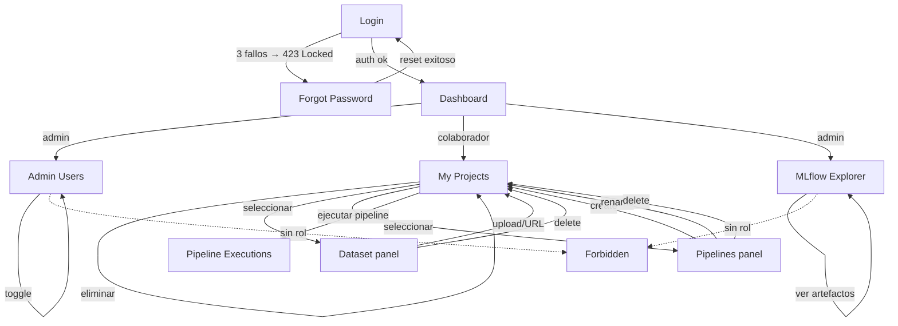

---

## 1. Login

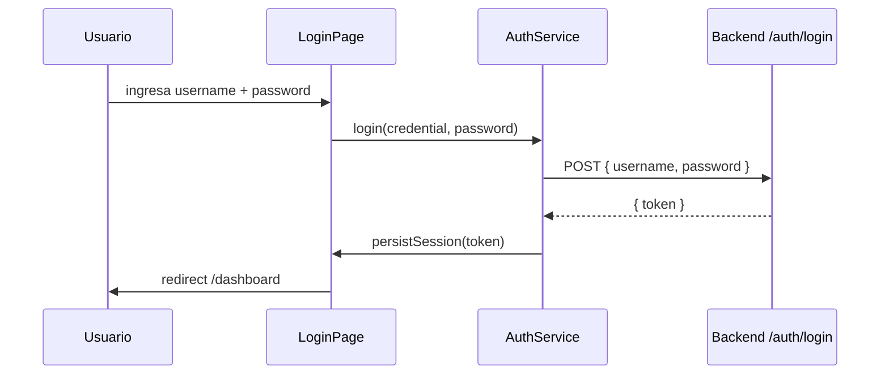

**Componentes:**
| Archivo | Rol |
|---|---|
| `features/auth/pages/LoginPage.tsx` | Orquestación del login, detecta 423 → redirect forgot-password |
| `features/auth/components/LoginForm.tsx` | Formulario con toggle visibilidad password (Eye/EyeOff) |
| `features/auth/api.ts` | `login()`, `logout()`, `forgotPassword()` |
| `features/auth/auth.mapper.ts` | `mapTokenToSessionUser` — decodifica JWT |
| `features/auth/hooks/useAuthSession.ts` | `persistSession`, `clearAuth` |

**Endpoints backend:**
| Endpoint | Status |
|---|---|
| `POST /api/v1/auth/login` | 200 JWT / 401 credenciales / 423 Locked (3 fallos) |

---

## 2. Forgot Password (bloqueo 3 intentos)

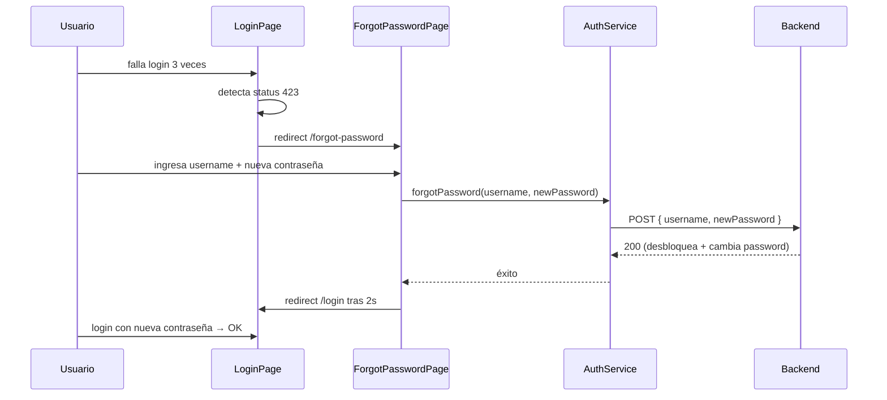

**Componentes:**
| Archivo | Rol |
|---|---|
| `features/auth/pages/ForgotPasswordPage.tsx` | Formulario username + nueva contraseña con toggle visibilidad |
| `features/auth/api.ts` | `forgotPassword()` — POST a `/auth/forgot-password` |
| `features/auth/types.ts` | `ForgotPasswordRequest { username, newPassword }` |

**Backend:**
| Archivo | Rol |
|---|---|
| `infra/exception/AccountLockedException.java` | Excepción cuenta bloqueada → 423 Locked |
| `infra/exception/GlobalExceptionHandler.java` | Handler 423 con `redirectTo: forgot-password` |
| `service/auth/AuthServiceImpl.java` | Contador ConcurrentHashMap + `TransactionTemplate` para reset |

**Endpoints backend:**
| Endpoint | Status |
|---|---|
| `POST /api/v1/auth/forgot-password` | 200 (desbloquea) / 400 (misma contraseña) |

---

## 3. Dashboard

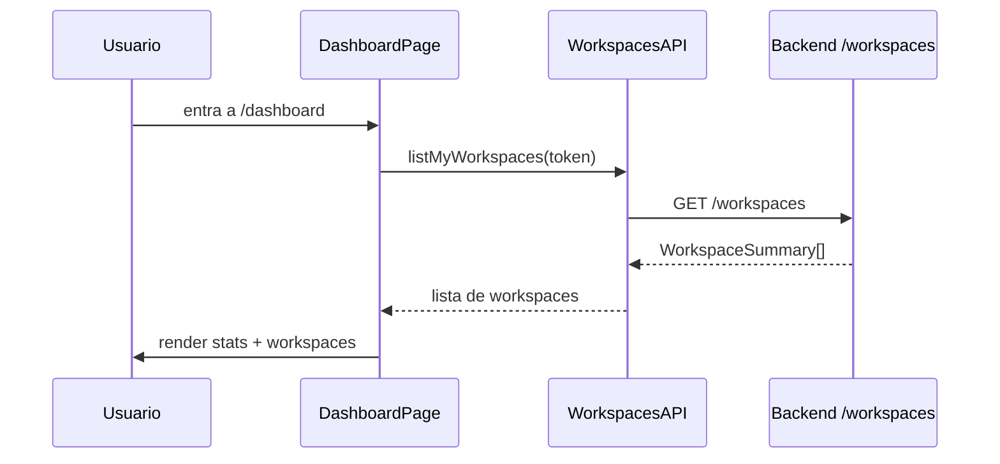

**Componentes:**
| Archivo | Rol |
|---|---|
| `features/dashboard/pages/DashboardPage.tsx` | Vista de resumen con stats |
| `features/workspaces/api.ts` | `listMyWorkspaces` |
| `shared/layout/AppShell.tsx` | Sidebar con search bar, header, logout |
| `features/auth/hooks/useProtectedSession.ts` | Sesión, 401→login, 403→forbidden, logout |

---

## 4. Admin Users

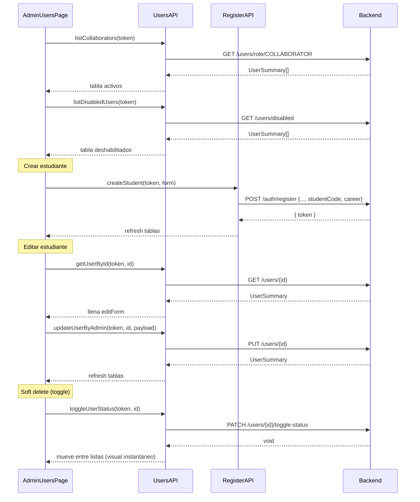

**Componentes:**
| Archivo | Rol |
|---|---|
| `features/admin/pages/AdminUsersPage.tsx` | Orquestación con búsqueda por username/nombre |
| `features/admin/api.ts` | `listCollaborators`, `listDisabledUsers`, `toggleUserStatus`, `updateUserByAdmin`, `createStudent`, `getUserById` |
| `features/admin/components/CreateStudentForm.tsx` | Form alta con studentCode + career |
| `features/admin/components/EditStudentForm.tsx` | Form edición con secciones |
| `features/admin/components/UsersTable.tsx` | Tabla reusable activos/deshabilitados |
| `features/admin/types.ts` | `UserSummary`, `CreateStudentFormData`, `UserUpdatePayload` |

**Endpoints backend:**
| Endpoint | Status |
|---|---|
| `GET /api/v1/users` | 200 |
| `GET /api/v1/users/{id}` | 200 |
| `PUT /api/v1/users/{id}` | 200 |
| `PATCH /api/v1/users/{id}/toggle-status` | 200 (no persiste en BD) |
| `GET /api/v1/users/disabled` | 200 |
| `GET /api/v1/users/me` | 200 |
| `PUT /api/v1/users/me` | 200 |
| `PATCH /api/v1/users/me/password` | 200 |
| `GET /api/v1/users/role/{role}` | 200 |

---

## 5. My Projects

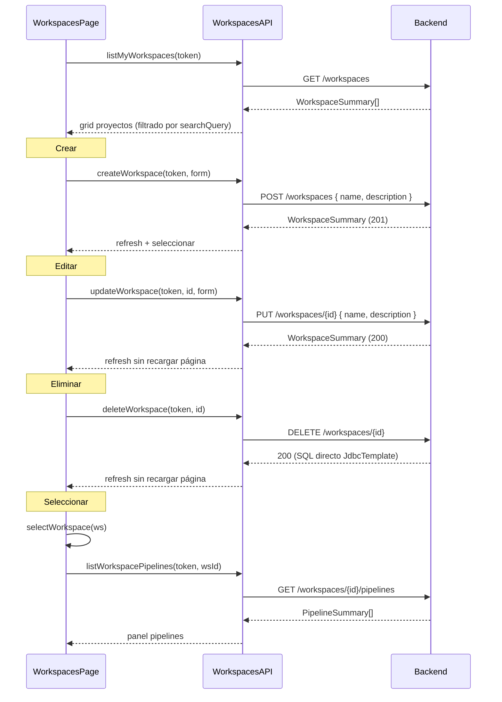

**Componentes:**
| Archivo | Rol |
|---|---|
| `features/workspaces/pages/WorkspacesPage.tsx` | Grid visual de cards, busca por nombre, CRUD directo |
| `features/workspaces/api.ts` | `listMyWorkspaces`, `create`, `update`, `delete`, `listWorkspacePipelines` |
| `features/workspaces/components/WorkspaceForm.tsx` | Form crear/editar |
| `features/workspaces/components/WorkspacesTable.tsx` | Tabla de proyectos |
| `features/workspaces/components/DatasetPanel.tsx` | Upload/Replace/View/URL download de dataset |
| `features/workspaces/components/PipelinesPanel.tsx` | CRUD pipelines (crear, renombrar, eliminar) |
| `features/workspaces/types.ts` | `WorkspaceSummary`, `PipelineSummary`, form types |

**Endpoints backend:**
| Endpoint | Status |
|---|---|
| `GET /api/v1/workspaces` | 200 |
| `POST /api/v1/workspaces` | 201 |
| `GET /api/v1/workspaces/{id}` | 200 |
| `PUT /api/v1/workspaces/{id}` | 200 (JdbcTemplate) |
| `DELETE /api/v1/workspaces/{id}` | 200 (JdbcTemplate) |
| `GET /api/v1/workspaces/all` | 200 (admin only) |

---

## 6. Dataset

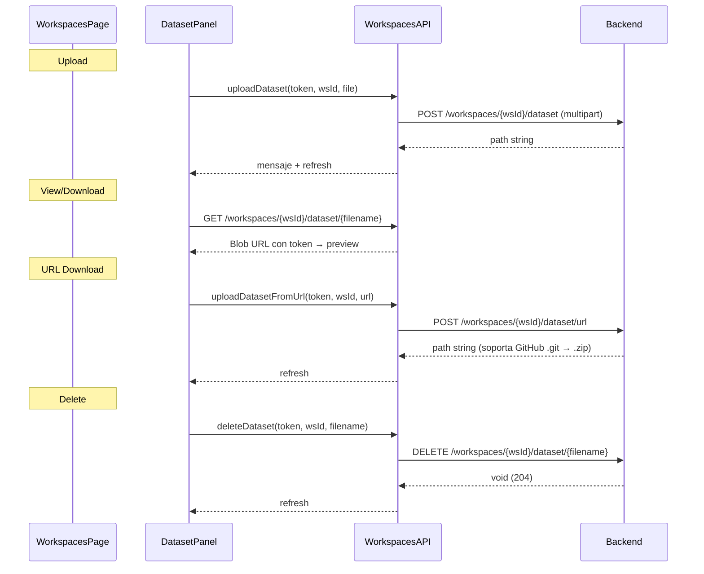

**Endpoints backend:**
| Endpoint | Status |
|---|---|
| `POST /workspaces/{id}/dataset` | 200 (solo .png/.jpg/.jpeg/.zip) |
| `GET /workspaces/{id}/dataset/{file}` | 200 |
| `DELETE /workspaces/{id}/dataset/{file}` | 204 |
| `POST /workspaces/{id}/dataset/url` | 200 (GitHub .git → main.zip, fallback master.zip) |

---

## 7. Pipelines

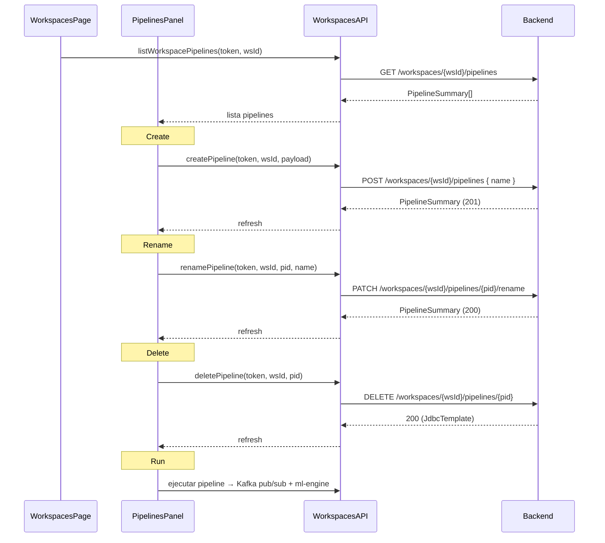

**Endpoints backend:**
| Endpoint | Status |
|---|---|
| `GET /workspaces/{id}/pipelines` | 200 |
| `POST /workspaces/{id}/pipelines` | 201 |
| `GET /workspaces/{id}/pipelines/{id}` | 200 |
| `DELETE /workspaces/{id}/pipelines/{id}` | 200 (JdbcTemplate) |
| `PATCH /workspaces/{id}/pipelines/{id}/rename` | 200 |

---

## 8. MLflow Explorer (Admin)

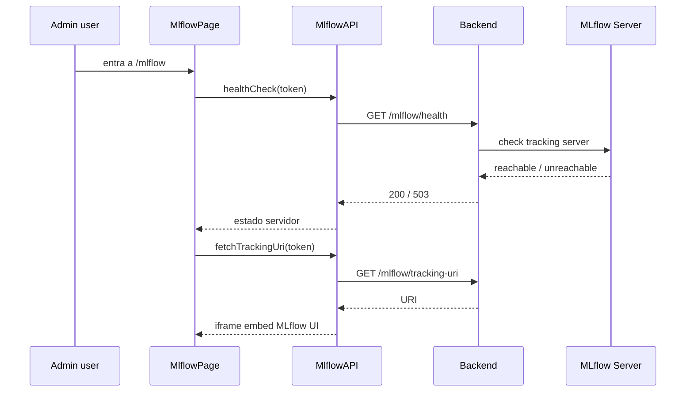

**Componentes:**
| Archivo | Rol |
|---|---|
| `features/mlflow/pages/MlflowPage.tsx` | Página admin con health check |
| `features/mlflow/components/MlflowPanel.tsx` | Panel con estadísticas y artefactos |
| `features/mlflow/api.ts` | `healthCheck()`, `fetchTrackingUri()`, `fetchArtifactUri()` |

**Endpoints backend:**
| Endpoint | Status |
|---|---|
| `GET /api/v1/mlflow/health` | 200 reachable / 503 unreachable |
| `GET /api/v1/mlflow/runs/{runId}/artifact-uri` | 200 |

---

## 9. Pipeline Executions

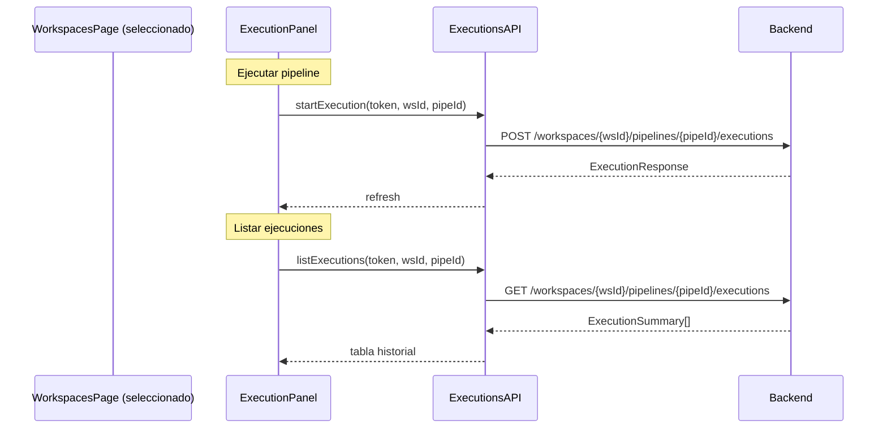

**Componentes:**
| Archivo | Rol |
|---|---|
| `features/executions/components/ExecutionPanel.tsx` | Tabla de historial de ejecuciones |
| `features/executions/api.ts` | `startExecution`, `listExecutions` |
| `features/executions/types.ts` | `ExecutionSummary`, params |

---

## 10. Forbidden

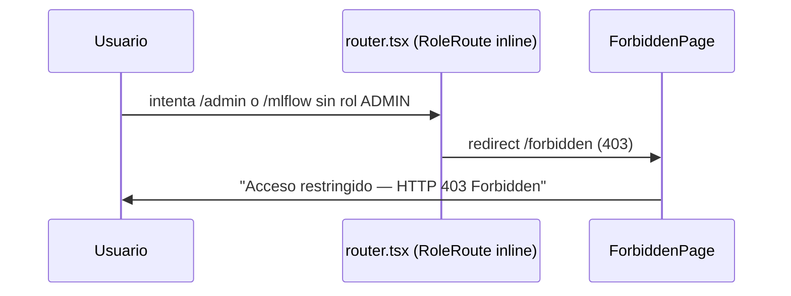

**Componentes:**
| Archivo | Rol |
|---|---|
| `app/router.tsx` | Guards ProtectedRoute y RoleRoute inline |
| `features/_shared/ForbiddenPage.tsx` | Pantalla 403 |
| `features/auth/hooks/useProtectedSession.ts` | `onAuthError` detecta 403 → redirect /forbidden |

---

## 11. Search Bar

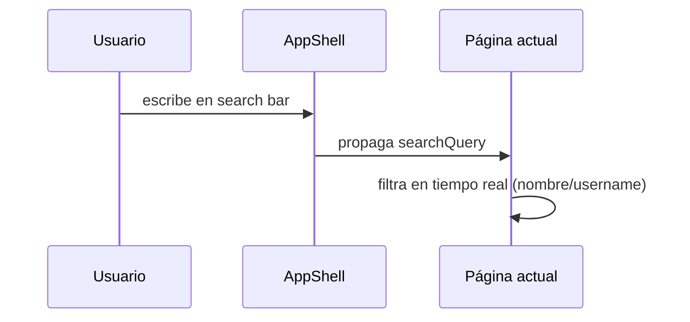

Implementado en `shared/layout/AppShell.tsx` con estado en `app/router.tsx`. Filtra workspaces por nombre y usuarios por username/nombre en tiempo real.

---

## Estado general de endpoints del Sprint 1

### Funcionando correctamente

| Módulo | Endpoints | Total |
|---|---|---|
| Auth | login, logout, register, forgot-password (con bloqueo 3 intentos) | 4/4 |
| Datasets | upload, download, delete, URL download | 4/4 |
| MLflow | health, runs/{runId}/artifact-uri | 2/2 |
| Pipelines | list, create, get, rename, delete | 5/5 |
| Users | list, get, update, disabled, me, /me password, role | 9/9 |
| Workspaces | list, create, get, update, delete, /all | 6/6 |
| **Total** | | **30/30** |

### Bugs pendientes

| Endpoint | Issue |
|---|---|
| `PATCH /users/{id}/toggle-status` | 200 visual pero no persiste en BD |
| `PUT /workspaces/{id}` | Fixed → 200 con JdbcTemplate |
| `DELETE /workspaces/{id}` | Fixed → 200 con JdbcTemplate |
| `DELETE /pipelines/{id}` | Fixed → 200 con JdbcTemplate |

### Backend fixes aplicados

| Archivo | Fix |
|---|---|
| `WorkspaceServiceImpl.java` | Update/delete usan JdbcTemplate en vez de JPA `save()`/`delete(entity)` |
| `PipelineServiceImpl.java` | Delete usa JdbcTemplate |
| `PipelineService.java` / `WorkspaceService.java` | Retorno `Mono<Long>` en vez de `Mono<Void>` |
| `WorkspaceController.java` / `PipelineController.java` | `.map()` en vez de `.thenReturn()` |
| `UserRepository.java` | `updatePasswordDirect` (SQL nativo) para forgot-password |
| `AuthServiceImpl.java` | `TransactionTemplate` + `ConcurrentHashMap` para bloqueo 3 intentos |

---

## Infraestructura Docker (docker-compose.yml)

| Servicio | Puerto | Imagen |
|---|---|---|
| postgres-db | 5433:5432 | postgres:17-alpine |
| kafka-broker | 9092:9092 | apache/kafka:3.7.0 |
| mlflow-server | 5000:5000 | ghcr.io/mlflow/mlflow:latest |
| ml-engine | 8000:8000 | synapseops/ml-engine:1.0.0 |
| backend-orchestrator | 8080:8080 | synapseops/backend-orchestrator:1.0.0 |
| prometheus-tsdb | 9090:9090 | prom/prometheus:v2.51.2 |
| grafana-dashboard | 3001:3000 | grafana/grafana:10.4.2 |
| cadvisor | 8081:8080 | gcr.io/cadvisor/cadvisor:v0.47.2 |
